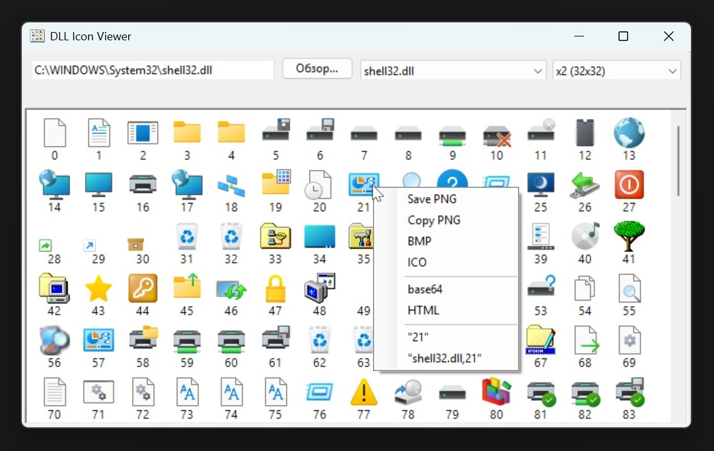

# DLL Icon Viewer



A lightweight, portable Windows application for browsing and extracting icons from DLL, EXE, ICL, CPL, SCR, OCX, ICO, PNG, JPG, and BMP files. No installation required.

## Features

- Browse all icons in a file in a scrollable grid
- Scale icons from 16×16 up to 256×256
- Right-click context menu to save or copy icons as PNG, BMP, ICO
- Copy icon as base64 data URI or HTML `` tag
- Quick-access dropdown with well-known Windows icon libraries
- Supports multi-size `.ico` files (shows each size separately)
- Progress bar during loading, cancelable
- Window icon set from `shell32.dll`

## How to Run

### 1. PowerShell (direct)
```powershell
powershell -ExecutionPolicy Bypass -File "dll-icon-viewer.ps1"
```

### 2. Batch file
Double-click `dll-icon-viewer.bat` — launches silently with a hidden PowerShell window.

### 3. Compiled executable
Double-click `dll-icon-viewer.exe` — fully standalone, no console window.

## How to Build

Requires [ps2exe](https://www.powershellgallery.com/packages/ps2exe) (PowerShell module).

```powershell
# Install ps2exe
Install-Module -Name ps2exe -Scope CurrentUser -Force

# Compile
Invoke-ps2exe -InputFile "dll-icon-viewer.ps1" -OutputFile "dll-icon-viewer.exe" -noConsole -lcid 1049
```

- `-noConsole` — hides the PowerShell console window
- `-lcid 1049` — sets locale to Russian (remove or change as needed)

The resulting `.exe` is portable and can be copied anywhere.
